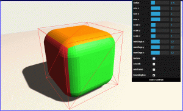
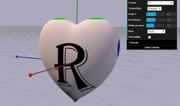

### Demos ###

- [Filleted Box](https://carlbateman.github.io/WebGL/demos/filletedbox/FilletedBox.html)
   Rounding the edges of a box inThree.js.   
   The fillet is generated by pushing all the vertices of a box onto a sphere then offsetting them to form the filleted box.

- [Heart Geometry](https://carlbateman.github.io/WebGL/demos/heartgeometry/HeartGeometry.html)
   Have a heart... for all your heart shaped geometry needs, Heart Geometry for Three.js   
   The geometry is the surface derived from the formula:   
       (2x² + y² + z² – 1)³ – 0.1x²z³ – y²z³  
  (Based on the C implementation by Mateusz Malczak)   
